<p align="center"></p>

<p align="center"><sub>10-second tour: Crawl → Queue → Dedupe → Analyze → Store → Dashboard</sub></p>

<p align="center">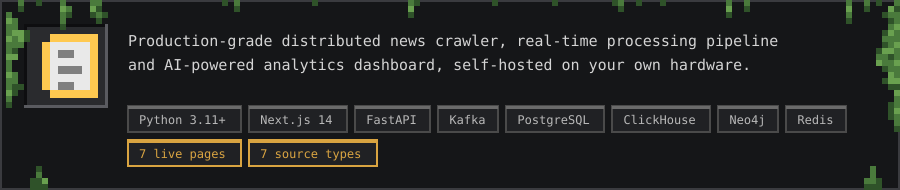</p>

<p align="center"></p>

<a id="what-is-this"></a>
<h2></h2>

<p align="center"></p>

<a id="one-step-setup"></a>
<h2></h2>

```bash
git clone https://github.com/thanmaiashok/news-intelligence.git
cd news-intelligence
./start.sh
```

<p align="center"></p>

<a id="architecture"></a>
<h2></h2>

```
┌─────────────────────────────────────────────────────────────────────────────┐
│                       NEWS INTELLIGENCE SYSTEM                               │
├──────────────┬──────────────────┬─────────────────┬────────────────────────┤
│  SOURCES     │  CRAWLER LAYER   │   KAFKA TOPICS  │  PROCESSING PIPELINE   │
│              │                  │                 │                        │
│  RSS Feeds   │  RSSCrawlerPool  │  news.raw  ──►  │  Deduplication         │
│  Web Pages   │  StaticWeb       │                 │  (SimHash + MinHash)   │
│  JS Sites    │  Playwright      │                 │  Multi-label Classify  │
│  Reddit      │  RedditCrawler   │  news.processed │  Sentiment (RoBERTa)   │
│  Bluesky     │  BlueskyCrawler  │                 │  NER (spaCy)           │
│  Mastodon    │  MastodonCrawler │  news.trends    │  Trend Detection       │
│  HN / GDELT  │  Scheduler       │                 │                        │
│              │  (every 2min)    │                 │                        │
├──────────────┴──────────────────┴─────────────────┴────────────────────────┤
│                              STORAGE LAYER                                   │
│                                                                              │
│  S3/MinIO         PostgreSQL          ClickHouse         Neo4j              │
│  (raw JSON)       (articles,          (analytics,        (knowledge graph:  │
│                    structured)         time-series)       Article→Topic     │
│                                                           Article→Entity    │
│  FAISS/Pinecone   Redis                                   Entity→Entity)    │
│  (embeddings)     (dedup cache,                                             │
│                    trend windows)                                            │
├──────────────────────────────────────────────────────────────────────────────┤
│                               AI LAYER                                       │
│                                                                              │
│  EmbeddingService          RAGEngine              InsightsGenerator         │
│  (sentence-transformers)   (FAISS + GPT-4o-mini)  (LLM + rule-based)       │
│                            Mystery Engine         Anomaly Detector          │
├──────────────────────────────────────────────────────────────────────────────┤
│                             FASTAPI BACKEND                                  │
│                                                                              │
│  REST API (/api/v1/*)      WebSocket (/ws/feed)   Kafka→WS Bridge           │
├──────────────────────────────────────────────────────────────────────────────┤
│                           NEXT.JS DASHBOARD                                  │
│                                                                              │
│  Overview │ Live Feed │ Trends │ Sentiment │ Graph │ Leads │ Control        │
└──────────────────────────────────────────────────────────────────────────────┘
```

<a id="project-structure"></a>
<h2></h2>

```
news-intelligence/
├── backend/
│   ├── ai/            Embeddings, RAG engine, insights generator, mystery pipeline
│   ├── api/           FastAPI app, REST routes, WebSocket bridge
│   ├── config/        Pydantic settings (env-driven)
│   ├── crawler/       RSS, web (Playwright), Reddit, Bluesky, Mastodon, HN, GDELT
│   ├── mystery/       Anomaly detection, LLM reasoning, pattern engine
│   ├── pipeline/      Kafka producer/consumer, dedup, classify, sentiment, NER, trends
│   ├── storage/       PostgreSQL, ClickHouse, Neo4j, S3, vector store clients
│   └── requirements.txt
├── frontend/
│   └── src/
│       ├── app/       7 Next.js pages
│       ├── components/ Per-page UI components
│       ├── hooks/     useWebSocket, usePolling
│       ├── lib/       API client
│       └── types/     TypeScript interfaces
├── deployment/
│   ├── docker/        docker-compose.yml (full infrastructure stack)
│   ├── k8s/           Kubernetes manifests (Namespace, Deployments, HPA)
│   └── scripts/       DB init SQL + Neo4j Cypher
├── .env.example       All config vars with comments
├── start.sh           One-command local startup
└── kill.sh            Graceful shutdown
```

<a id="configuration"></a>
<h2></h2>

<p align="center">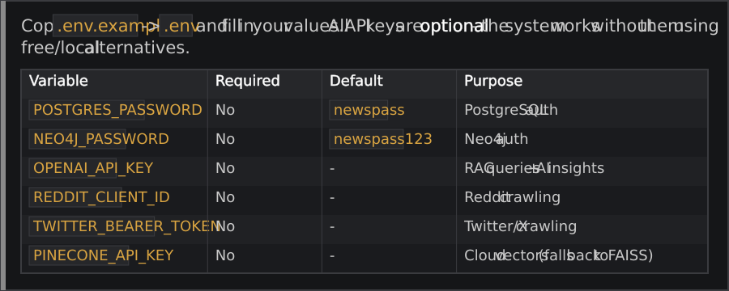</p>

<a id="optional-api-keys"></a>
<h2></h2>

<p align="center">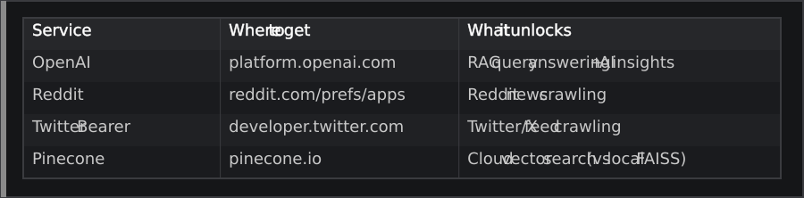</p>

<a id="home-server--tailscale"></a>
<h2></h2>

<p align="center">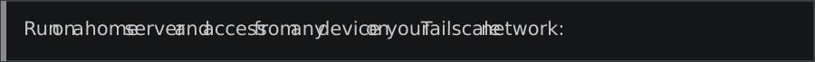</p>

```bash
./start.sh   # auto-detects Tailscale IP
```

<p align="center">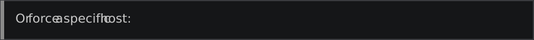</p>

```bash
SERVER_HOST=my-server-hostname ./start.sh
```

<p align="center">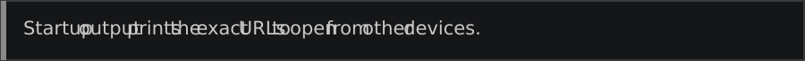</p>

<a id="full-docker-stack"></a>
<h2></h2>

```bash
cp .env.example .env
cd deployment/docker
docker compose up --build
```

<a id="kubernetes"></a>
<h2></h2>

```bash
# Build and push images
docker build -t your-registry/news-api:latest ./backend
docker build -t your-registry/news-frontend:latest ./frontend
docker push your-registry/news-api:latest
docker push your-registry/news-frontend:latest

# Deploy
kubectl create secret generic news-secrets --from-env-file=.env -n news-intelligence
kubectl apply -f deployment/k8s/
```

<a id="tech-stack"></a>
<h2></h2>

<p align="center">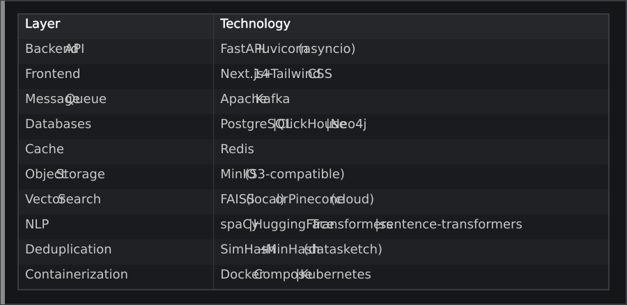</p>

<a id="contributing"></a>
<h2></h2>

<p align="center">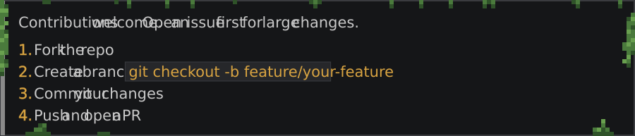</p>

<a id="license"></a>
<h2></h2>

<p align="center">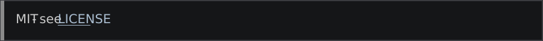</p>

<p align="center"><a href="LICENSE">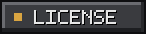</a></p>

<p align="center"><a href="https://github.com/thanmaiashok"></a></p>
